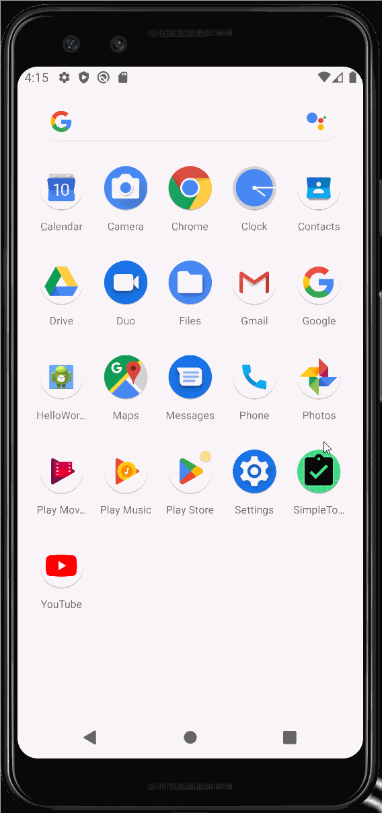

# SimpleToDoKotlinVersion

# Project 1 - SimpleToDo

**SimpleToDo** is an Android app using Kotlin that allows building a todo list and basic todo items management functionality including adding new items, editing and deleting an existing item.

Submitted by: Ritika Suresh

Time spent: **4** hours spent in total

## User Stories

The following **required** functionality is completed:

* [x] User can **view a list of todo items**
* [x] User can **successfully add and remove items** from the todo list
* [x] User's **list of items persisted** upon modification and and retrieved properly on app restart

The following **optional** features are implemented:

* [x] User can **tap a todo item in the list and bring up an edit screen for the todo item** and then have any changes to the text reflected in the todo list

The following **additional** features are implemented:

* [x] adding icon for the app
* [x] changing edit screen title
* [x] adding star checkbox so user can mark important items
* [x] having star checkbox property persisted upon modification and retrieved properly on app restart

## Video Walkthrough

Here's a walkthrough of implemented user stories:

GIF created with [LiceCap](http://www.cockos.com/licecap/).

## Notes

Describe any challenges encountered while building the app.

I have previous experience with Android Studio so using the actual software was fairly easy for me once I got the hang of it again. The challenge that I had was using Kotlin for the first time rather than Java which I have prior experience with and figuring out how to work with a new language and its syntax.

## License

    Copyright [2022] [Ritika Suresh]

    Licensed under the Apache License, Version 2.0 (the "License");
    you may not use this file except in compliance with the License.
    You may obtain a copy of the License at

        http://www.apache.org/licenses/LICENSE-2.0

    Unless required by applicable law or agreed to in writing, software
    distributed under the License is distributed on an "AS IS" BASIS,
    WITHOUT WARRANTIES OR CONDITIONS OF ANY KIND, either express or implied.
    See the License for the specific language governing permissions and
    limitations under the License.
